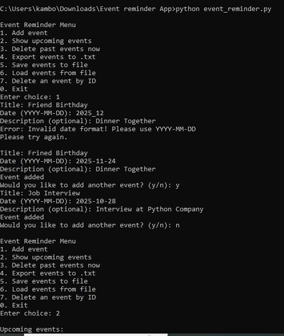
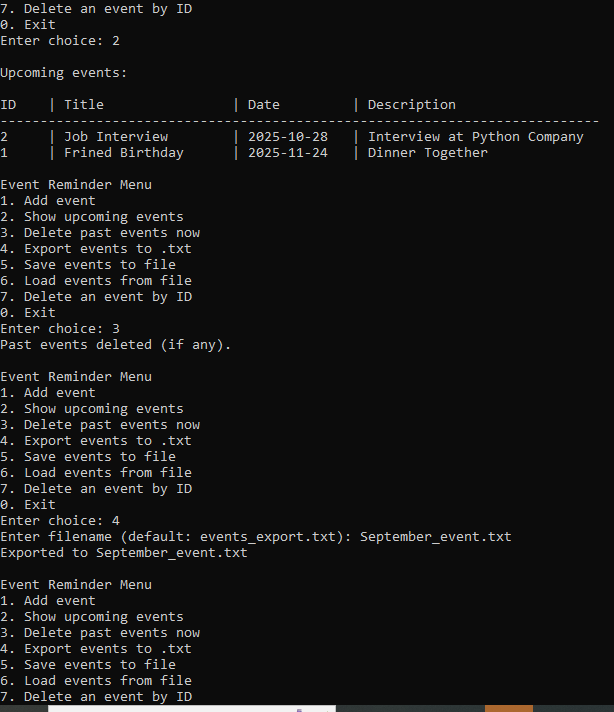
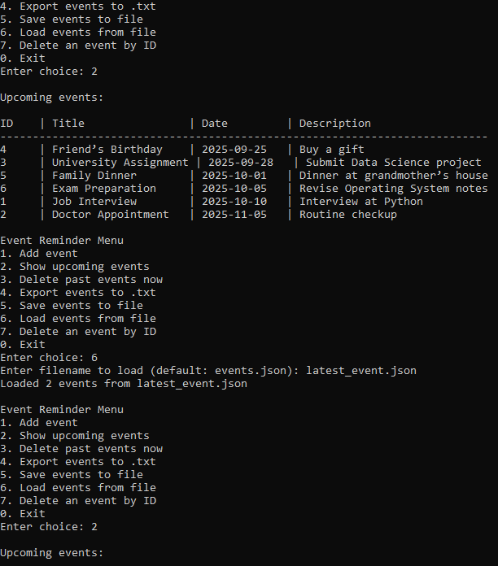
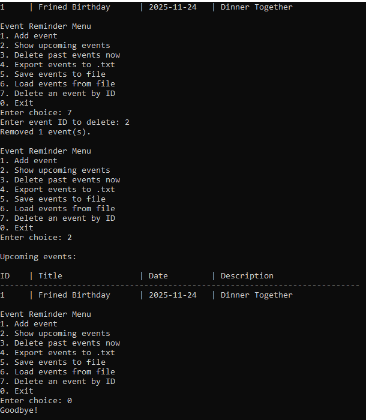

# 📅 Event Reminder App | Python Command-Line Project  

A simple and practical **command-line Event Reminder App** developed using **Core Python**.  
This project helps users add, view, and manage events easily from the terminal while also strengthening Python fundamentals like data handling, file operations, and date/time manipulation.  

---

## 📋 Table of Contents  
- 📚 Project Overview  
- 🚀 Features  
- 🧠 Concepts Covered  
- ⚙️ Installation  
- 🎮 How to Use  
- 📸 Screenshots  
- 🚧 Future Enhancements  
- ✨ Author  
- 📄 License  

---

## 📚 Project Overview  

This is a **Personal Event Reminder App** where users can:  
- Add important events (title, date, description)  
- View upcoming events  
- Delete past events automatically  
- Save events in a file and load them anytime  

The project focuses on:  
- Practicing **Core Python** concepts  
- Handling **date and time** using Python’s `datetime` module  
- File handling (`.json` & `.txt`)  
- Creating a **menu-driven CLI application**  

---

## 🚀 Features  

✅ Add events with **title, date, and description**  
✅ Show all **upcoming events** in a table format  
✅ Delete past events automatically  
✅ Save data to a file (`.json`)  
✅ Load saved events back into the app  
✅ Export event list to `.txt` for sharing/printing  
✅ Delete any event by its **ID**  
✅ Simple **menu-based navigation**  

---

## 🧠 Concepts Covered  

- Variables, Input/Output  
- Strings, Lists, Dictionaries  
- Conditional Statements (if, elif, else)  
- Loops (for, while)  
- Functions  
- File Handling (`json`, `.txt`)  
- Date/Time (`datetime` module)  
- Sorting and filtering data  

---

## ⚙️ Installation  

1. **Clone the repository**  
```bash
git clone https://github.com/TalalLiaquat/event-reminder.git
````

2. **Navigate to the project folder**

```bash
cd event-reminder
```

3. **Run the application**

```bash
python event_reminder.py
```

---

## 🎮 How to Use

* Run the script → `python event_reminder.py`
* A **menu** will appear like this:

```
Event Reminder Menu
1. Add event
2. Show upcoming events
3. Delete past events now
4. Export events to .txt
5. Save events to file
6. Load events from file
7. Delete an event by ID
0. Exit
```

### Example Usage:

1. **Add an Event** → Enter title, date (YYYY-MM-DD), and optional description
2. **Show Events** → View all upcoming events neatly in a table
3. **Delete Past Events** → Old events are removed automatically
4. **Save Events** → Save your data to `events.json`
5. **Load Events** → Load your saved events again even after closing the program
6. **Export Events** → Export events into a `.txt` file

---

## 📸 Screenshots  

### ▶ Menu  
  

### ▶ Adding an Event  
  

### ▶ Viewing Events  
  

### ▶ Loading Events from File  
  

---

## 🚧 Future Enhancements

* Set reminders with **notifications**
* Add **time** along with date
* Monthly/weekly reports
* Export events to **Excel/CSV**
* Support for recurring events (e.g., birthdays every year)
* Search events by keyword

---

## ✨ Author

Developed by ❤️**M. Talal Liaquat**❤️

* GitHub: [TalalLiaquat](https://github.com/TalalLiaquat)
* LinkedIn: *https://www.linkedin.com/in/talal-liaquat/*

## 📄 License  
This project is licensed under the [MIT License](LICENSE).

